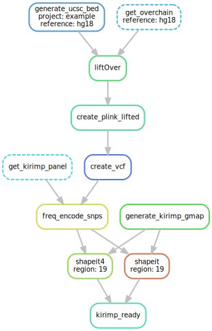
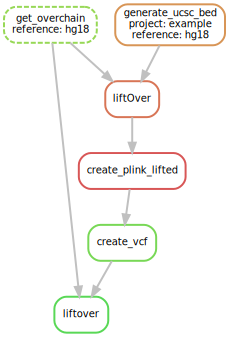
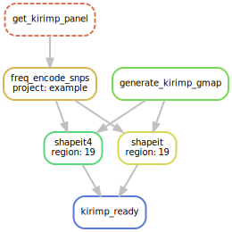
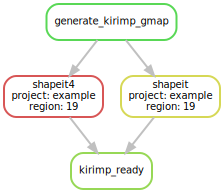

# HLA and KIR Imputation from SNP

[](https://snakemake.bitbucket.io)
[](https://travis-ci.org/snakemake-workflows/hla-kir-imp)

## Authors

* Johnathan D. (@bjohnnyd)

## Usage

### Workflow Overview

The full workflow consists of creating datasets ready for imputation:



The steps can be summarized as:

    1. Convert input PLINK bed files to reference b37
    2. Encode REF/ALT alleles the same as the KIR*IMP reference panel
    3. Phase the encoded VCF using shapeit4 and shapeit.

### Quickstart

To run the pipeline edit `config.yaml` to point to your input PLINK bed file by placing the following yaml directives:

```yaml
project:
  <project name>:
    liftover:
      plink: <path to PLINK bed file>
```

where `<project name>` is the name you want to be associated with your run and output and `<path to PLINK bed file>` is the full or relative path to your input PLINK bed file.

To run the pipeline run the command:

```{bash}
snakemake -j<number of parallel jobs> --use-conda 
```

The default PLINK bed file is assumed to be on `hg18` reference but additional reference types are possible as `hg16`,`hg17`,`hg38`. To specify for example reference `hg17` edit `config.yaml` with the following:

```yaml
project:
  <project name>:
    liftover:
      plink: <path to PLINK bed file>
      reference: hg17
```

All output will produced inside the `output/<project name>` directory.

Configure the workflow according to your needs via editing the file `config.yaml`. To see the list of default configurations settings run the command `snakemake print_defaults`.


### Running Specific Parts or Running Workflow in Steps

The workflow can be ran from a specific part. In addition, the workflow can be run in steps allowing to explore the data before phasing and filtering.

To see the list of specific rules/steps that are possible run `snakemake --list-target-rules`.  Each of the target rules listed can be run with the command `snakemake -j<number of parallel jobs> [OPTIONS] <target rule name>`.

#### Example 1: Running Only Liftover



It is possible to only use the workflow to perform liftover of PLINK bed files from specific reference to `b37`. This will produce a VCF file with the reference being `b37`.

To perform only liftover with the same `config.yaml` from [Quickstart](#quickstart) run the command:

```{bash}
snakemake -j<number of parallel jobs> --use-conda liftover
```

#### Example 2: Encode VCF Without Liftover or Perform Liftover and Encoding Without Phasing With SHAPEIT



If you have VCF file based on reference `b37` it is possible to only run encoding without liftover. To encode the VCF file using KIR*IMP reference panel edit `config.yaml`:

```yaml
project:
  <project name>:
    freq_encode_snps:
      vcf: <path to VCF file>
```

then execute snakemake using the command:

```{bash}
snakemake -j<number of parallel jobs> --use-conda kirimp_encode
```

If the above command is executed with the `config.yaml` settings from [Quickstart](#quickstart) only liftover and encoding will be performed. This allows inspection of the variants in the VCF by looking at the images produced in `output/{project}/kirimp/01_freq_encode_snps/{project}.png`.  The images might help in deducing what threshold to use during SHAPEIT for filtering troublesome variants with missing genotypes.


#### Example 3: Run SHAPEIT After Checking VCF Statistics



To run SHAPEIT and prepare data for KIR*IMP using the file produced by running `snakemake -j<number of parallel jobs> --use-conda kirimp_encode` run the command:

```{bash}
snakemake -j<number of parallel jobs> --use-conda kirimp_ready
```

In addition, SHAPEIT can be run on a specific VCF (not necessarily produced by the workflow) by specifying the vcf file under the shapeit directive in `config.yaml`:

```yaml
project:
  <project name>:
    shapeit
      vcf: <Path to VCF file>
```

### Additional and Default Parameters

The default parameters settings and there descriptions are listed below and can be modified by placing it in `config.yaml` with the desired values different from defaults:

```yaml
BCFTOOLS_THREADS: 4
KIRIMP_PANEL_URL: http://imp.science.unimelb.edu.au/kir/static/kirimp.uk1.snp.info.csv
PLINK_THREADS: 4
SHAPEIT_GENMAP_URL: https://github.com/odelaneau/shapeit4/blob/master/maps/genetic_maps.b37.tar.gz?raw=true
SHAPEIT_THREADS: 4

project:
  <project name>:
    freq_encode_snps:
      vcf: output/{project}/liftover/04_hg19_vcf/{project}.{reference}ToHg19.vcf.gz
      additional: "--outlier-threshold 0.1" # additional parameters to be passed to the script in 'scripts/frequency_encode_snps.py'.
    liftover:
      reference: hg18 # Input PLINK bed reference can be either hg16, hg17, hg18 or hg38
    shapeit:
      vcf: output/{project}/kirimp/01_freq_encode_snps/{project}.vcf.gz
      gmap: input/meta/shapeit/kirimp.chr19.gmap.txt.gz
      pbwt: 8 # shapeit4: determines the number of conditioning neighbours, higher number should produce better accuracy but slower runtimes
      pbwt-modulo: 8 # shapeit4: determines variants for storing pbwt indexes
      regions: [19] # chromosomes for phasing default is 19 for KIR*IMP
      states: 500 # shapeit2: determines number of haplotypes for conditioning, higher number should produce better accuracy but slower runtimes
      min_missing: 0.25 # variants with missing genotype rate larger than this will be discarded before phasing with SHAPEIT. Inspect the image from kirimp_encode to determine threshold
      v2_additional: "" # Additional parameters for shapeit version 2.  Description of possible settings can be found at https://mathgen.stats.ox.ac.uk/genetics_software/shapeit/shapeit.html
      v4_additional: "" # Additional parameters for shapeit version 4.  Description of possible settings can be found at https://odelaneau.github.io/shapeit4/
```

### Workflow Running Options

Test your configuration by performing a dry-run via

    snakemake --use-conda -npr

Execute the workflow locally via

    snakemake --use-conda -j $N

using `$N` cores or run it in a cluster environment via

    snakemake --use-conda --cluster qsub --jobs 100

or if `DRMAA` is available

    snakemake --use-conda --drmaa --jobs 100

If you not only want to fix the software stack but also the underlying OS, use

    snakemake --use-conda --use-singularity

in combination with any of the modes above.
See the [Snakemake documentation](https://snakemake.readthedocs.io/en/stable/executable.html) for further details.

# Step 4: Investigate results

After successful execution, you can create a self-contained interactive HTML report with all results via:

    snakemake --report report.html
